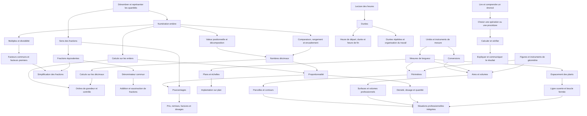

# Carte des prérequis — Prépa Clé - v2.2
**Version : 2.2 — carte fonctionnelle**

## 1. Vue d’ensemble

## 2. Dépendances détaillées

### A. Numération et calcul

| Notion cible | Prérequis principaux | Remarque pédagogique |
|---|---|---|
| Valeur positionnelle des entiers | Dénombrer, grouper, lire les chiffres | Distinguer la valeur du chiffre de sa position |
| Décomposition additive | Valeur positionnelle | Exemple : 321 = 300 + 20 + 1 |
| Décomposition multiplicative | Valeur positionnelle et multiplication | Exemple : 321 = 3 × 100 + 2 × 10 + 1 |
| Comparaison des décimaux | Valeur positionnelle décimale | Ne pas comparer les nombres en comptant seulement les chiffres après la virgule |
| Zéros terminaux | Valeur des dixièmes et centièmes | 2,50 = 2,5 |
| Zéros internes | Valeur positionnelle décimale | 2,05 est différent de 2,5 |
| Calcul posé sur les entiers | Numération et sens des opérations | Revenir au sens de l’opération si la procédure est mécanique |
| Calcul sur les décimaux | Calcul sur les entiers et numération décimale | Vérifier la position de la virgule et l’ordre de grandeur |
| Contrôle d’un résultat | Estimation et contexte | L’estimation peut précéder ou suivre le calcul exact |

### B. Divisibilité et fractions

| Notion cible | Prérequis principaux | Remarque pédagogique |
|---|---|---|
| Multiples et diviseurs | Multiplication et division entières | Utiliser des exemples concrets de groupements |
| Critères de divisibilité | Numération entière et multiples | Enseigner séparément les critères avant de les combiner |
| Facteurs premiers | Multiplication, division et divisibilité | Ne pas imposer cette méthode à tous les problèmes de fractions |
| Sens d’une fraction | Partage équitable, unité de référence | Faire varier les représentations : objets, longueur, surface |
| Fractions équivalentes | Sens de la fraction et multiplication | Vérifier que la quantité représentée reste la même |
| Simplification | Fractions équivalentes et diviseur commun | La décomposition en facteurs premiers est une méthode possible, pas l’unique point d’entrée |
| Dénominateur commun | Multiples et fractions équivalentes | Prévoir une méthode par multiples et une méthode par facteurs |
| Addition et soustraction de fractions | Sens de la fraction et dénominateur commun | Commencer par les dénominateurs identiques |
| Fraction d’une quantité | Sens de la fraction et division ; multiplication selon la procédure | Utiliser des quantités divisibles simplement au départ |

### C. Proportionnalité et pourcentages

| Notion cible | Prérequis principaux | Remarque pédagogique |
|---|---|---|
| Reconnaître la proportionnalité | Comparaison de quantités et sens des opérations | Comparer aussi avec des situations non proportionnelles |
| Tableau de proportionnalité | Multiplication et division | Expliciter les unités des colonnes |
| Passage à l’unité | Division et multiplication | Souvent utile pour des quantités professionnelles |
| Coefficient de proportionnalité | Multiplication et division | Le coefficient doit être interprété dans le contexte |
| Pourcentage comme part de 100 | Fractions et écriture décimale simple | Construire le sens avant la technique |
| Calcul d’un pourcentage | Pourcentage, multiplication et proportionnalité | Distinguer « calculer la part » de « déterminer le taux » |
| Retrouver le tout | Pourcentage et raisonnement inverse | À introduire après les cas directs |
| Remise ou augmentation | Pourcentage et prix | Distinguer montant de la variation et prix final |
| Dosage et dilution | Proportionnalité, unités et pourcentages selon le cas | Toujours préciser la grandeur concernée et l’unité |

**Principe de souplesse :** un apprenant peut travailler sur 10 % d’un prix à partir de stratégies mentales avant de maîtriser les opérations sur les fractions. Les prérequis doivent être fonctionnels pour la tâche, pas nécessairement maîtrisés dans leur totalité.

### D. Mesures, géométrie et espace

| Notion cible | Prérequis principaux | Remarque pédagogique |
|---|---|---|
| Choix d’un instrument | Identifier la grandeur à mesurer | Distinguer longueur, aire, volume, masse et durée |
| Lecture d’une mesure | Graduation et unité | Vérifier le zéro de départ et la précision de lecture |
| Conversion de longueur | Tableau des unités et valeur positionnelle | Relier les conversions aux mesures réelles |
| Conversion d’aire | Sens de l’aire et unités carrées | Ne pas traiter comme une simple conversion de longueur |
| Conversion de volume | Sens du volume et unités cubiques | Relier, lorsque pertinent, volume et capacité |
| Périmètre | Longueur et reconnaissance des figures | Le périmètre est une longueur, pas une surface |
| Aire | Reconnaissance des figures et unités d’aire | Distinguer aire et périmètre avant les formules |
| Volume | Solides, unités cubiques et mesures | Traiter cube, pavé droit et cylindre ; sphère si le parcours le requiert |
| Construction géométrique | Lecture des consignes et usage des instruments | Décomposer les constructions en gestes élémentaires |
| Rapporteur | Reconnaissance des angles et alignement | Enseigner séparément centre, ligne de base et choix de graduation |
| Échelle | Conversion des unités et proportionnalité | Vérifier systématiquement si l’on passe du plan au réel ou du réel au plan |
| Lecture de plan | Légende, coordonnées et repérage spatial | Le calcul n’est qu’une partie de la tâche |
| Implantation professionnelle | Mesures, plan et échelle selon la tâche | Ajouter les contraintes de terrain et les retraits aux extrémités |

### E. Temps

| Notion cible | Prérequis principaux | Remarque pédagogique |
|---|---|---|
| Lire l’heure | Repères de l’horloge et formats horaires | Travailler analogique et numérique |
| Calculer une durée | Lire les horaires et comprendre les unités | Distinguer heure affichée et durée écoulée |
| Trouver l’heure de fin | Heure de départ et durée | Traiter les changements d’heure et de jour progressivement |
| Trouver l’heure de départ | Heure de fin et durée | Exige un raisonnement inverse |
| Additionner des durées | Heures, minutes et secondes | Ne pas additionner les minutes comme des nombres décimaux ordinaires |
| Multiplier une durée répétée | Multiplication et conversion d’unités de temps | Exemple : durée d’un geste × nombre de répétitions |
| Lire un planning | Lire les horaires et calculer les durées | Les chevauchements et pauses peuvent faire l’objet d’un approfondissement |

### F. Implantation et espaces verts

| Notion cible | Prérequis principaux | Point de vigilance |
|---|---|---|
| Mesurer une ligne de plantation | Mesure de longueur et lecture d’un plan si nécessaire | Vérifier les unités |
| Espacement régulier sur une ligne | Division et compréhension des intervalles | Le nombre d’intervalles n’est pas toujours le nombre de plants |
| Ligne ouverte, extrémités occupées | Espacement régulier et comptage | Plants = intervalles + 1 |
| Boucle fermée autour d’un lac | Espacement régulier et compréhension de la fermeture | Plants = intervalles si le dernier intervalle rejoint le premier plant |
| Retrait aux extrémités | Mesure de longueur et soustraction | Calculer la longueur réellement plantable |
| Plantation en rangées | Comptage et multiplication | Distinguer plants par rang et nombre de rangs |
| Densité de plantation | Surface, quantité et proportionnalité selon le problème | Vérifier les unités de surface |
| Dosage d’un produit | Proportionnalité, unités et pourcentage selon la formulation | Identifier si le dosage est par litre, surface, volume ou quantité de matière |

### G. Résolution et communication

| Notion cible | Prérequis principaux | Remarque pédagogique |
|---|---|---|
| Reformuler un énoncé | Compréhension des mots et des données | Utiliser des phrases courtes sans supprimer les informations utiles |
| Choisir une opération | Sens des opérations et identification de la question | Ne pas se fier uniquement à un mot-clé |
| Organiser une résolution | Sélection des données et plan d’action | Faire expliciter les étapes avant le calcul si nécessaire |
| Contrôler un résultat | Estimation, unité et contexte | Un résultat exact peut être incohérent si les données ont été mal interprétées |
| Expliquer une procédure | Vocabulaire mathématique et ordre des étapes | Accepter d’abord une explication orale ou schématique |
| Transmettre un calcul oralement | Vocabulaire, nombres et opérations | Vérifier que l’information transmise n’a pas été modifiée |

## 3. Ordre de travail recommandé, sans parcours rigide

### Bloc A — socle numérique
Numération entière → valeur positionnelle → comparaison → calculs entiers → estimation et contrôle.

### Bloc B — décimaux et mesures
Numération décimale → calculs décimaux → unités et conversions → mesures concrètes.

### Bloc C — fractions et proportionnalité
Sens des fractions → équivalences → simplification → dénominateur commun et opérations ; en parallèle, proportionnalité → pourcentages et applications.

### Bloc D — géométrie et espace
Figures et instruments → périmètres → aires → volumes ; en parallèle, repérage → plans → échelles → applications professionnelles.

### Bloc E — temps et données
Lecture de l’heure → durées → horaires et plannings ; lecture de tableaux → graphiques → contrôle des données.

### Bloc F — réinvestissement
Problèmes à plusieurs opérations → situations de vie courante → situations professionnelles adaptées au parcours → communication et contrôle du résultat.

## 4. Règles d’utilisation de la carte

1. **La carte n’est pas un programme linéaire.** Elle sert à repérer les prérequis d’une tâche et à proposer un retour ciblé.
2. **Une flèche indique une dépendance fonctionnelle**, pas nécessairement un ordre chronologique strict.
3. **Un contexte professionnel ne prouve pas la maîtrise d’une notion.** Une fiche de plantation peut être réussie par imitation ; il faut prévoir des variantes pour vérifier le transfert.
4. **Une erreur n’indique pas à elle seule son origine.** Il faut examiner la procédure : compréhension de l’énoncé, choix de l’opération, calcul, unité, lecture de graphique ou contrôle.
5. **Le renforcement peut être ponctuel.** Il est possible d’utiliser une fiche REN sur un seul prérequis sans refaire tout un parcours.
6. **Les fiches SIT viennent après un apprentissage suffisant des notions mobilisées**, sauf si elles servent explicitement au diagnostic.
7. **Les aides PLURI sont transversales.** Elles peuvent être utilisées dès la première fiche, sans attendre un parcours spécifique de langue.

## 5. Vérification documentaire à conserver dans le dépôt

Pour chaque famille, conserver un tableau de correspondance avec :
- la formulation du référentiel régional ;
- le critère CléA correspondant, s’il existe ;
- le programme scolaire ou CAP de référence ;
- l’identifiant de catalogue ;
- le statut du lien : exigence explicite, prérequis, approfondissement ou application professionnelle ;
- la justification de toute notion ajoutée au-delà du référentiel principal.

Les programmes officiels de CAP et les référentiels professionnels doivent rester distincts : les premiers cadrent les apprentissages mathématiques de la formation, tandis que les seconds permettent de choisir les applications métier pertinentes. La page Éduscol rassemble les programmes et ressources de mathématiques de la voie professionnelle ; les ressources ChloroFil peuvent compléter l’analyse des contextes agricoles et paysagers. [Éduscol — mathématiques en voie professionnelle](https://eduscol.education.gouv.fr/31275/domaines-enseignement/mathematiques-lycee-professionnel).
