# Prépa Clé — Bloc 4 - carte des dépendances consolidée

**Version : 2.3 — prérequis et dépendances souples**

## 1. Principes de lecture

Une dépendance signifie qu’une connaissance antérieure est utile ou nécessaire à une tâche. Elle ne signifie pas que tous les apprenants doivent suivre le même ordre de fiches.

Trois niveaux sont distingués :

- **Prérequis fort** : sans cette connaissance, la tâche cible est généralement inaccessible ou fortement compromise.
- **Prérequis fonctionnel** : la tâche peut être commencée dans un contexte simplifié, mais une maîtrise minimale est nécessaire pour l’autonomie.
- **Dépendance souple** : la notion peut être abordée dans un contexte concret avant que toutes les procédures formelles soient maîtrisées.

## 2. Graphe général

```mermaid
flowchart TD
    A["Dénombrer et représenter des quantités"] --> B["Lire et écrire les entiers"]
    B --> C["Valeur positionnelle et décomposition"]
    C --> D["Comparer, ordonner et encadrer"]
    C --> E["Nombres décimaux"]
    B --> F["Sens des quatre opérations"]
    F --> G["Calculs entiers"]
    E --> H["Calculs décimaux"]
    G --> I["Estimation et contrôle"]
    H --> I

    B --> J["Multiples et diviseurs"]
    J --> K["Critères de divisibilité"]
    K --> L["Facteurs communs et facteurs premiers"]
    A --> M["Sens de la fraction"]
    M --> N["Fractions équivalentes"]
    L --> O["Simplification des fractions"]
    N --> O
    N --> P["Dénominateur commun"]
    P --> Q["Addition et soustraction de fractions"]

    F --> R["Proportionnalité"]
    E --> R
    R --> S["Pourcentages"]
    M --> S
    S --> T["Remises, factures, dosages et évolutions"]

    U["Choisir une unité et un instrument"] --> V["Lire une mesure"]
    V --> W["Conversions de longueur"]
    V --> X["Conversions de masse et capacité"]
    V --> Y["Conversions d'aire et de volume"]
    W --> Z["Périmètres"]
    W --> AA["Plans et échelles"]
    AB["Reconnaître les figures"] --> AC["Construire avec des instruments"]
    AB --> Z
    AB --> AD["Aires"]
    AB --> AE["Volumes"]
    Y --> AD
    Y --> AE

    AF["Lire l'heure"] --> AG["Calculer une durée"]
    AG --> AH["Trouver l'heure de fin ou de départ"]
    AG --> AI["Durées répétées et planning"]

    AA --> AJ["Lire un plan d'implantation"]
    Z --> AK["Mesurer les contours d'une parcelle"]
    AD --> AL["Surfaces et densités"]
    AE --> AM["Quantités à partir d'un volume"]
    W --> AN["Espacement régulier"]
    AN --> AO["Ligne ouverte"]
    AN --> AP["Boucle fermée"]
    AN --> AQ["Rangées et retraits"]
    AL --> AR["Situation professionnelle intégrée"]
    AM --> AR
    AJ --> AR
    AO --> AR
    AP --> AR
    AQ --> AR

    AS["Comprendre et reformuler un énoncé"] --> AT["Choisir une stratégie"]
    AT --> AU["Calculer et contrôler"]
    AU --> AV["Expliquer et transmettre le raisonnement"]
```

## 3. Prérequis forts

| Notion cible | Prérequis fort | Justification |
|---|---|---|
| Comparer des entiers | Valeur positionnelle | La comparaison s’appuie sur les rangs |
| Décomposer un nombre | Valeur positionnelle | Les rangs déterminent la décomposition |
| Comparer des décimaux | Valeur des chiffres décimaux | Évite la comparaison erronée par longueur d’écriture |
| Effectuer les opérations | Sens des opérations et numération | La technique ne suffit pas à choisir ou interpréter le calcul |
| Calculer sur les décimaux | Calcul entier et valeur positionnelle décimale | Permet de contrôler le placement de la virgule |
| Simplifier une fraction | Fraction équivalente et diviseur commun | La simplification doit conserver la valeur |
| Additionner des fractions de dénominateurs différents | Fractions équivalentes et dénominateur commun | Les parts doivent être exprimées dans une unité commune |
| Calculer une aire | Compréhension de l’aire et unités carrées | Évite la confusion entre contour et surface |
| Calculer un volume | Compréhension du volume et unités cubiques | Le volume est une grandeur tridimensionnelle |
| Calculer une distance réelle sur un plan | Lecture de l’échelle et conversions nécessaires | L’échelle relie les longueurs du plan et du terrain |
| Calculer une durée | Lecture des horaires et unités de temps | Les heures et minutes ne suivent pas la base décimale |
| Calculer une plantation régulière | Longueur, espacement et comptage des intervalles | La relation plants/intervalles dépend de la géométrie |

## 4. Dépendances fonctionnelles

| Notion cible | Préparation fonctionnelle | Pourquoi elle peut varier |
|---|---|---|
| Calculer 10 % d’un prix | Sens du pourcentage et multiplication/division simples | Des stratégies mentales peuvent suffire avant une procédure générale |
| Utiliser un tableau de proportionnalité | Multiplication et division | Le passage à l’unité peut être enseigné dans un contexte concret |
| Calculer un dosage | Unités, proportionnalité et parfois pourcentages | La méthode dépend de l’unité du dosage et de la formulation |
| Lire un tableau | Repérer titres, lignes, colonnes et unités | Une tâche simple peut être abordée avant les calculs sur les données |
| Lire un plan | Légende, orientation et repérage | Le calcul de distance n’est pas toujours nécessaire |
| Construire un triangle | Lecture de consigne et usage des instruments requis | Les instruments nécessaires dépendent des données fournies |
| Calculer une surface professionnelle | Unités, formule appropriée et mesures | Une mesure directe ou un plan peut être utilisé selon la tâche |
| Expliquer un calcul oralement | Compréhension de la procédure | L’explication peut être travaillée dès les premières fiches, même avec un vocabulaire encore limité |

## 5. Points de contrôle obligatoires

### Nombres décimaux
La carte doit faire apparaître la valeur positionnelle avant les techniques de comparaison et de calcul. Une fiche sur les zéros doit faire distinguer :
- \(2,5 = 2,50\) ;
- \(2,05 \ne 2,5\).

### Nombres relatifs
Il faut distinguer quatre objets d’apprentissage :
- repérer un nombre positif ou négatif ;
- comparer deux nombres relatifs ;
- déterminer la distance à zéro et l’opposé ;
- calculer avec des nombres relatifs.

La confusion entre le signe d’un nombre et le signe d’une opération doit faire l’objet d’un diagnostic fondé sur la procédure de l’apprenant.

### Fractions
La simplification ne doit pas être présentée comme une règle de division de deux nombres sans justification. L’équivalence des fractions est la notion centrale ; les critères de divisibilité et les facteurs premiers constituent des outils possibles.

### Temps
La carte doit différencier :
- lire une heure ;
- calculer une durée entre deux horaires ;
- trouver l’heure de fin ;
- retrouver l’heure de départ ;
- multiplier une durée répétée ;
- interpréter un planning.

### Espaces verts
La carte doit différencier :
- ligne ouverte avec deux extrémités occupées ;
- boucle fermée ;
- plantation en rangées ;
- implantation avec retrait aux extrémités ;
- espacement irrégulier.

Les formules simples ne doivent être appliquées qu’après avoir identifié la géométrie réelle du problème.

## 6. Comment utiliser cette carte pour individualiser les parcours

1. Choisir une compétence cible à partir du référentiel ou du besoin professionnel.
2. Proposer une tâche courte permettant d’observer la procédure.
3. Repérer le premier prérequis réellement bloquant.
4. Affecter une fiche de renforcement sur ce prérequis, plutôt que de faire reprendre tout un domaine.
5. Revenir à la tâche cible avec une variante pour vérifier le transfert.
6. Consigner le résultat et les aides nécessaires, sans conclure à partir d’une seule erreur.

La carte sert à construire des parcours à la carte, pas à imposer une séquence identique à tous.

## 7. Limites

Cette carte représente les dépendances pédagogiques principales. Elle n’est pas une cartographie exhaustive de chaque micro-compétence des programmes de collège et de CAP. Les liens les plus fins doivent être ajoutés au fur et à mesure que les fiches sont rédigées, testées et rattachées à des critères précis.